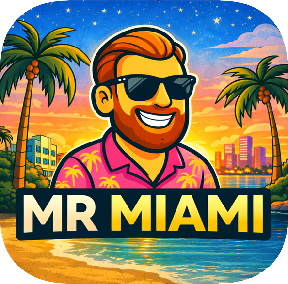
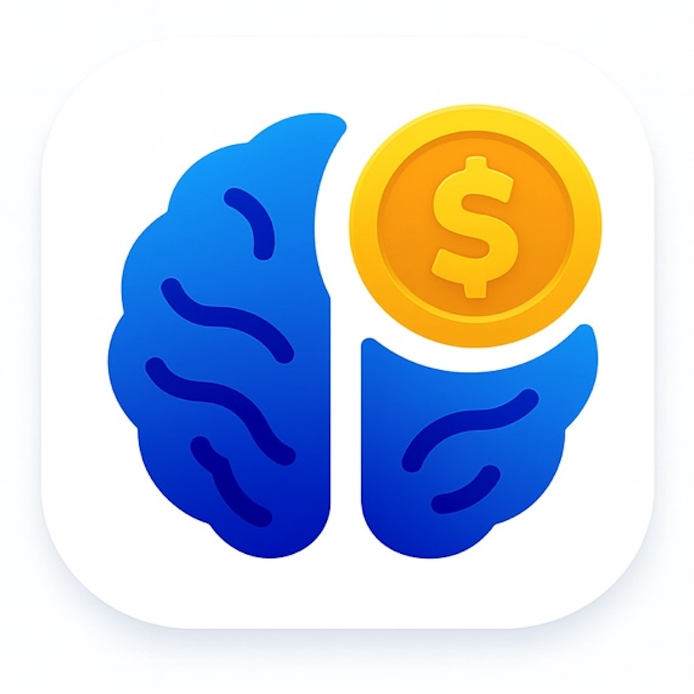
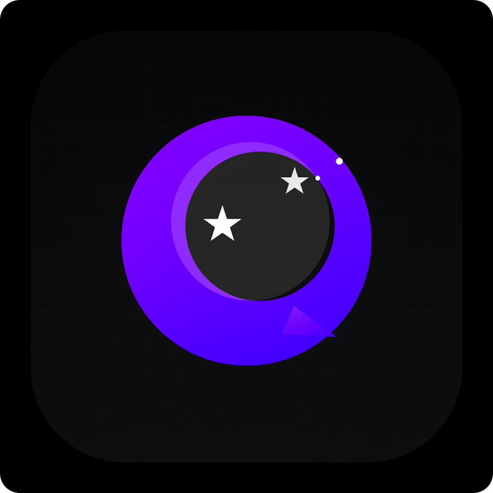
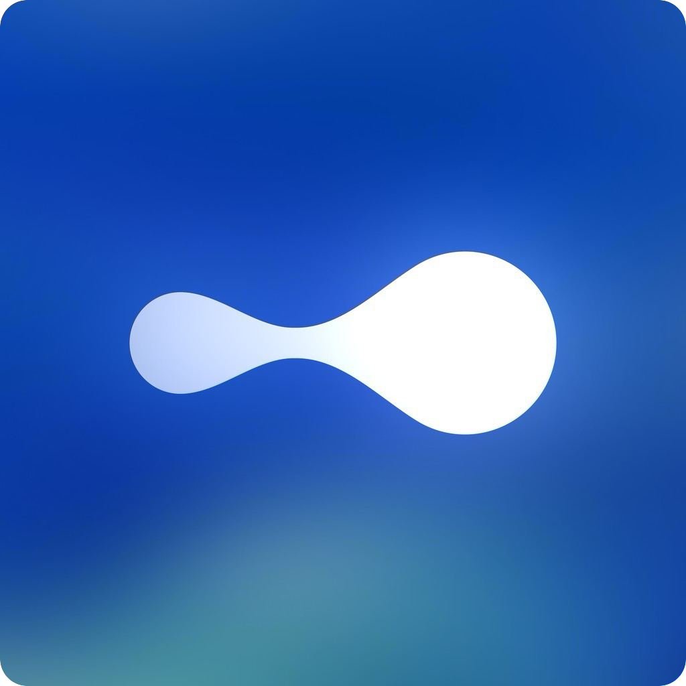
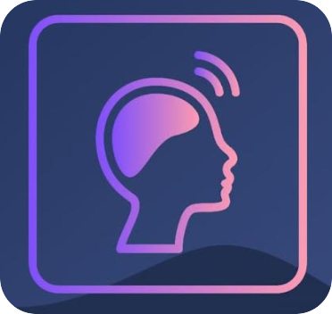
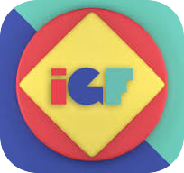

  <h1>I'm M.Alp</h1>
  <h3>Software Engineer</h3>
  
Mobile engineer focused on AI-powered products and real-world solutions. I specialize in native iOS & Android development, from concept to App Store.

---

## 📱 Featured Projects

###  Mr Miami
**Your Personal Travel Concierge & Life Guide** `In Development`

AI-powered travel companion for discovering the best of Miami.

**Tech:** SwiftUI, iOS, AI Integration

---

###  RichMind AI
**Personal Life Assistant & Habit Tracker** `Live 2025`

Personal development app with AI mentorship and habit tracking.

**Tech:** SwiftUI, iOS 17+, Firebase, OpenAI

---

###  Lucky AI
**AI-Powered Astrology & Birth Chart** `Sold 2025`

Personalized horoscope and birth chart analysis powered by AI.

**Tech:** SwiftUI, iOS, OpenAI API

---

###  Nezaket Abla
**AI-Powered Turkish Coffee Fortune Telling** `MVP Ready 2025`

Traditional Turkish coffee fortune telling with AI interpretation.

**Tech:** SwiftUI, iOS, CoreML/Vision

---

###  Misu AI
**Your Personal AI Companion** `MVP Ready 2025`

AI companion with professional chef recipes and culinary guidance.

**Tech:** SwiftUI (iOS) & Kotlin (Android)

---

###  H-Talks
**Medical Professional Live Streaming Platform** `Completed 2021`

Live streaming platform for pharmaceutical presentations (500-1000 concurrent viewers).

**Tech:** UIKit (iOS) & Kotlin (Android), Vimeo Live

---

###  Dry Clean Express
**Professional Dry Cleaning CRM System** `Completed 2021`

Comprehensive CRM system for dry cleaning businesses.

**Tech:** UIKit, iOS, CocoaPods

---

###  Migraine Tracker
**Migraine Tracker & Doctor Sharing** `Completed 2020`

Migraine tracking app with QR code sharing for doctors.

**Tech:** iOS & Android

---

###  Istanbul Genclik Festivali
**Event Management Platform** `Completed 2019`

Event management application for Istanbul Youth Festival.

**Tech:** UIKit (iOS) & Kotlin (Android)

---

## 🛠️ Tech Stack

---

## 📫 Contact

---

